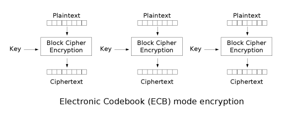
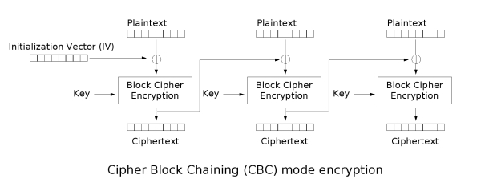
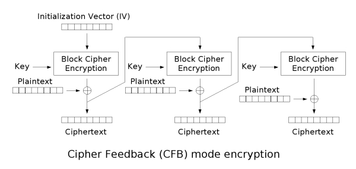
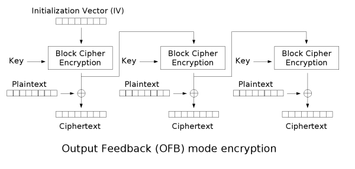
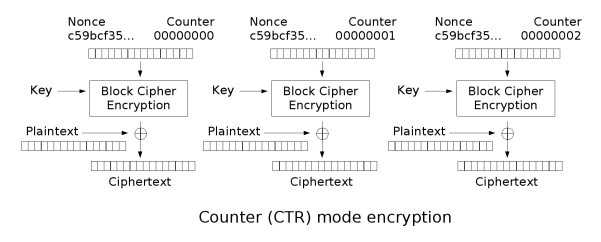
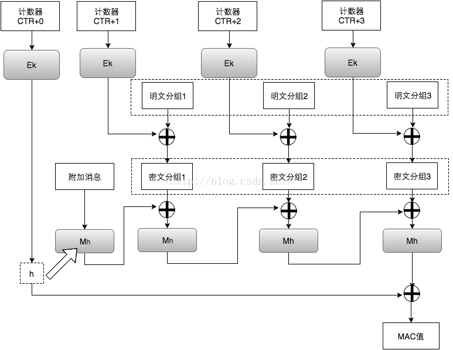

参考:

[https://zh.wikipedia.org/wiki/%E9%AB%98%E7%BA%A7%E5%8A%A0%E5%AF%86%E6%A0%87%E5%87%86](https://zh.wikipedia.org/wiki/%E9%AB%98%E7%BA%A7%E5%8A%A0%E5%AF%86%E6%A0%87%E5%87%86)

[http://www.361way.com/aes/5830.html](http://www.361way.com/aes/5830.html)
[https://blog.csdn.net/T0mato_/article/details/53160772](https://blog.csdn.net/T0mato_/article/details/53160772)

[https://zhuanlan.zhihu.com/p/78913397](https://zhuanlan.zhihu.com/p/78913397)
## AES加密的几种工作模式

### ECB模式
ECB模式又称电子密码本模式（Electronic codebook）：ECB是最简单的块密码加密模式，==加密前根据加密块大小（如AES为128位）分成若干块，之后将每块使用相同的密钥单独加密==，解密同理。具体见下图

特点  
1、ECB模式由于每块数据的加密是独立的因此加密和解密都可以并行计算
2、相同的明文块会被加密成相同的密文块 

### CBC模式
CBC模式又称密码分组链接（Cipher-block chaining）：==CBC模式对于每个待加密的密码块在加密前会先与前一个密码块的密文异或然后再用加密器加密==。第一个明文块与一个叫初始化向量的数据块异或。如下图：

特点

1、AES_cbc_encrypt允许length不是16(128位)的整数倍，不足的部分会用0填充，输出总是16的整数倍
2、由于对每个数据块的加密依赖与前一个数据块的加密所以加密无法并行

3、在加密前需要对数据进行填充，不是很适合对流数据进行加密。

### CFB模式
CFB模式又称密文反馈模式（Cipher feedback)：与ECB和CBC模式只能够加密块数据不同，==CFB能够将块密文（Block Cipher）转换为流密文==（Stream Cipher）。见下图

CFB的加密工作分为两部分：

==1、将一前段加密得到的密文再加密；==

==2、将第1步加密得到的数据与当前段的明文异或==

特点
1、由于加密流程和解密流程中被块加密器加密的数据是前一段密文，因此即使明文数据的长度不是加密块大小的整数倍也是不需要填充的，这保证了数据长度在加密前后是相同的

#### OFB模式

OFB模式又称输出反馈模式（Output feedback）：O==FB是先用块加密器生成密钥流（Keystream），然后再将密钥流与明文流异或得到密文流，解密是先用块加密器生成密钥流，再将密钥流与密文流异或得到明文==，由于异或操作的对称性所以加密和解密的流程是完全一样的。来看下图：

特点

1、OFB与CFB一样都非常适合对流数据的加密，OFB由于加密和解密都依赖与前一段数据，所以加密和解密都不能并行
#### CTR模式
==在计数器模式下，我们不再对密文进行加密，而是对一个逐次累加的计数器进行加密==，用加密后的比特序列与明文分组进行 XOR得到密文。过程如下图

#### GCM模式

GCM可以提供对消息的加密和完整性校验，另外，它还可以提供附加消息的完整性校验。在实际应用场景中，有些信息是我们不需要保密，但信息的接收者需要确认它的真实性的，例如源IP，源端口，目的IP，IV，等等。因此，我们可以将这一部分作为附加消息加入到MAC值的计算当中。下图的Ek表示用对称秘钥k对输入做AES运算。最后，密文接收者会收到密文、IV（计数器CTR的初始值）、MAC值

